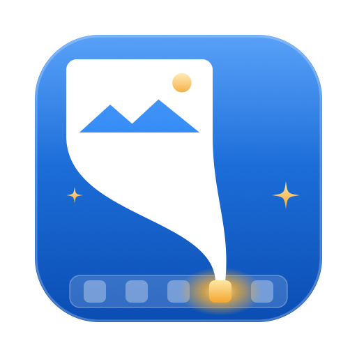
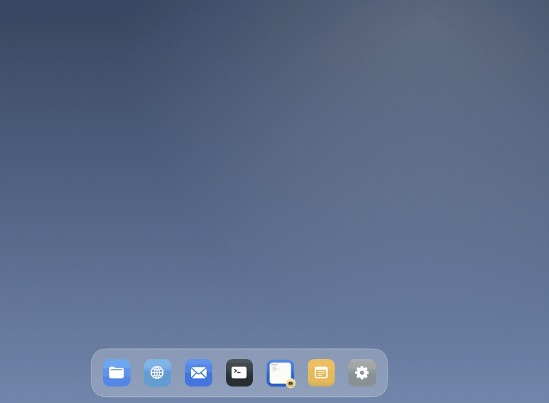
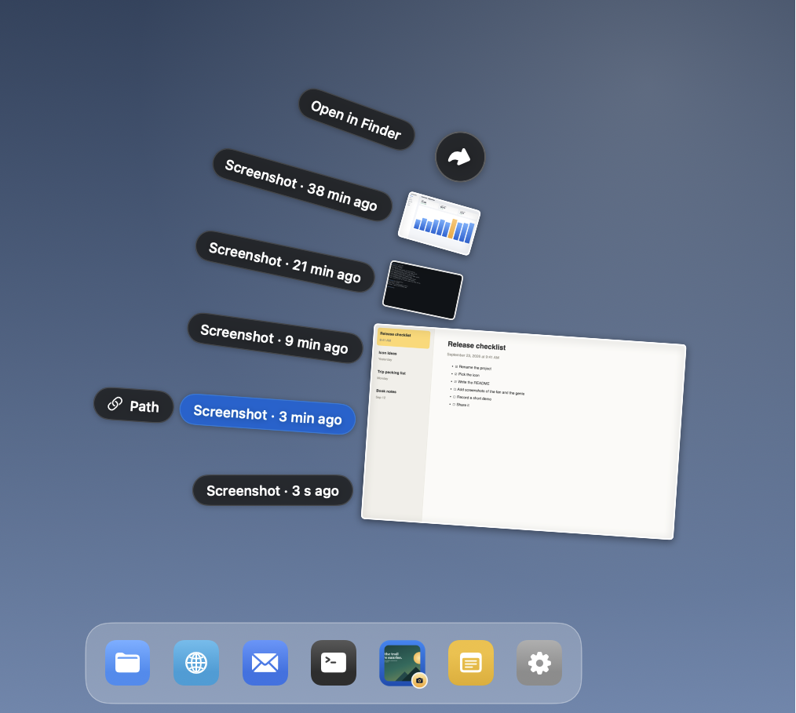
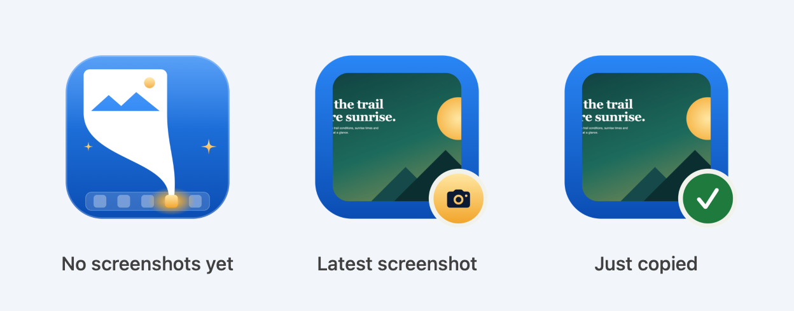
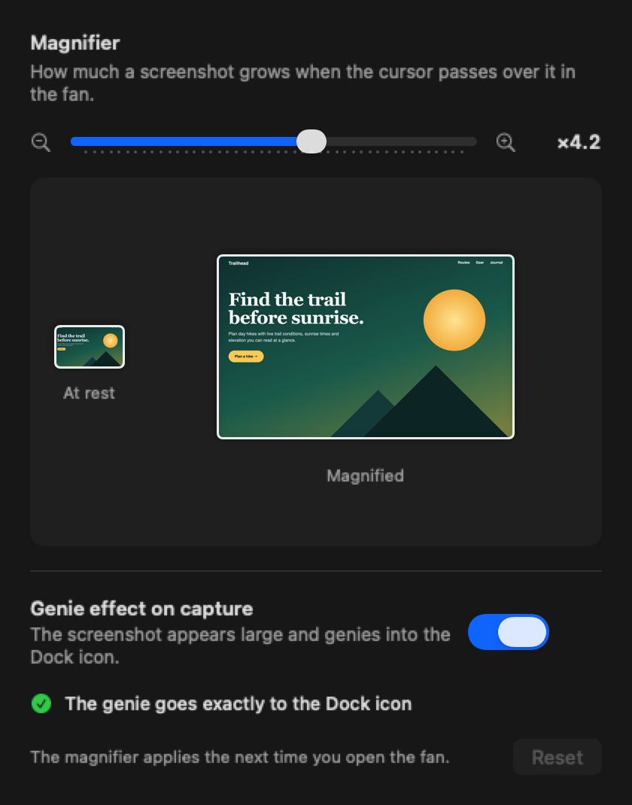

<p align="center"></p>

# ShotGenie

A macOS Dock app for your latest screenshots. Take a screenshot with ⌘⇧4 as usual: it genies into the ShotGenie icon, and the icon becomes a thumbnail of it. Click the icon to fan out your last five screenshots, like a Dock stack, with a magnifier on the one under the cursor. Click one and its **image** is on the clipboard, ready to paste into a terminal (Claude Code shows it as `[Image #N]`), a chat or a document.

It was built to stop hunting through Finder for the screenshot you just took so you can paste it into Claude Code.

<p align="center"></p>

<p align="center"><sub>The screenshot genies into the icon → click the icon → the fan opens and the magnifier follows the cursor → click to copy the image.</sub></p>

## What it does

- **Live Dock icon.** The icon shows the latest screenshot, with a gold camera badge (green check right after copying).
- **Genie effect.** When a screenshot lands, it appears large on the screen where you took it and genies into the app's real Dock position, in whatever direction the Dock is from that screen (multi-display aware).
- **Fan with magnifier.** Left-click the icon: the last 5 screenshots fan out; the one under the cursor is magnified (×1.5–×6, set in Settings, ⌘,).
- **Copy image or path.** Click a screenshot to copy the image itself (PNG + TIFF, no file URL, so terminals paste the image and not the path). The "Ruta" pill copies the path, escaped with backslashes like a Finder drag into Terminal.
- **Dock menu.** Right-click the icon for a text menu with the last 5 screenshots; each item also has a ⌥ alternate that copies the path, plus "copy path of the latest" and "open screenshots folder". The Dock does not draw images in its menus, so this one is text only.
- **Focus goes back.** After copying, the app you were using becomes active again, so ⌘V goes straight to it.

## Screenshots

**Click the Dock icon: the fan.** The screenshot under the cursor is magnified; click it to copy the image, or click "Path" to copy its path.

<p align="center"></p>

**The icon is always your latest screenshot.** It turns green for a moment after copying.

<p align="center"></p>

**Settings (⌘,)** for the magnifier strength and the genie effect.

<p align="center"></p>

The images are made from sample screenshots by `scripts/docs/render.sh` (needs Google Chrome and ffmpeg), using the app's own views.

## Download

Get **ShotGenie-0.3.0.dmg** from [Releases](https://github.com/enderjnets/ShotGenie/releases/latest). It is a universal app (Apple Silicon and Intel) for macOS 26 or later.

1. Open the DMG and double-click **Install ShotGenie**.
2. The installer is not notarized by Apple, so macOS blocks it the first time: go to **System Settings → Privacy & Security**, scroll down to "Install ShotGenie was blocked", and click **Open Anyway**.
3. The installer copies ShotGenie to **Applications** (to `~/Applications` if your account is not an administrator) and opens it. It removes the download quarantine from that copy, so macOS doesn't block the app a second time.
4. Right-click the icon in the Dock → Options → **Keep in Dock**.
5. Optional: allow **Accessibility** in ShotGenie's Settings (⌘,) so the genie lands exactly on the icon.

The release also has **ShotGenie-0.3.0.zip** with just the app, if you prefer to move it to Applications yourself (then "Open Anyway" applies to ShotGenie).

Prefer to build it yourself? See below.

## Requirements (to build)

- macOS 26 or later
- Xcode 27 command line tools (Swift 6)

## Build and install

```bash
git clone https://github.com/enderjnets/ShotGenie.git
cd ShotGenie
swift test          # core logic tests
scripts/build.sh    # builds, signs and installs ~/Applications/ShotGenie.app
open ~/Applications/ShotGenie.app
```

`scripts/make-dmg.sh` builds the downloadable installer, `dist/ShotGenie-<version>.dmg` (it installs [dmgbuild](https://github.com/dmgbuild/dmgbuild) in `.build/` the first time).

Right-click the icon in the Dock → Options → Keep in Dock.

### Accessibility permission (for the genie)

To aim the genie at the icon, ShotGenie asks the Dock where its icon is, which needs **System Settings → Privacy & Security → Accessibility**. Settings (⌘,) shows the status and has an "Allow…" button. Without it, the genie falls back to the spot where you last clicked the icon, or the bottom center of the screen.

macOS ties this permission to the app's signature. With the default ad hoc signature you must grant it again after every rebuild. To keep it, create a code-signing certificate once (Keychain Access → Certificate Assistant → Create a Certificate…, type "Code Signing"; it does not need to be trusted) and put its name in `scripts/local.env` (ignored by git):

```bash
SIGN_IDENTITY="My Local Signing"
```

### Optional: faster screenshots

With macOS's floating thumbnail on, the screenshot file is only written when the thumbnail goes away (about 5 seconds), so ShotGenie sees it late. `scripts/setup-capturas.sh` turns the thumbnail off and saves screenshots to `~/Pictures/ScreenCaptures`. It backs up your previous settings; `scripts/revert-capturas.sh` restores them. ShotGenie itself follows whatever folder macOS saves screenshots to, so this step is optional.

## Similar tools

Checked in September 2026. Each covers part of this; none of the ones found combines the Dock icon, the fan and copying the image itself.

| Tool | What it does |
|---|---|
| Screenshots folder as a Dock stack (built into macOS) | Fans out recent files; clicking opens the file instead of copying it. |
| [CleanShot X](https://cleanshot.com/features) (paid) | Replaces the screenshot tool; capture history in the menu bar. |
| [Dropover](https://dropoverapp.com/whats-new/4.14.0) | Shows a shelf with each new screenshot; can copy it to the clipboard. |
| [shotpath](https://hboon.com/automatically-copy-macos-screenshot-path-for-claude-code/) | Background service that copies the path of each new screenshot, for Claude Code. |
| [claude-screenshot-uploader](https://github.com/mdrzn/claude-screenshot-uploader) | Uploads screenshots over SSH for remote Claude Code sessions. |

## Notes

- The interface follows your macOS language. English and Spanish are included; other languages fall back to English. To add one, copy `Resources/es.lproj` and translate it.
- The bundle identifier is `com.enderj.screencapture` (the project's earlier name); it is kept so existing installs keep their permission and settings.
- Debug-only defaults (`defaults write com.enderj.screencapture <key> <value>`): `debugIconPath`, `debugPanelPath` + `debugHover`, `debugGenieDir`, `debugGenieScreen`, `debugStatusPath`. They write renders to disk so the UI can be checked without looking at the screen.

## Project layout

- `Sources/ShotGenieCore`: pure logic (fan layout, genie geometry, Dock/screen matching, path escaping), tested with Swift Testing.
- `Sources/ShotGenie`: the AppKit app (Dock icon, folder watcher, fan panel, genie window, settings).
- `Sources/ShotGenieInstaller`: "Install ShotGenie", the small app inside the DMG that copies ShotGenie to Applications.
- `Resources/AppIcon.svg`: the app icon; `scripts/build.sh` turns it into `AppIcon.icns`.
- `scripts/dmg/`: the DMG window (`background.html` → `Resources/Installer/background.tiff`) and its dmgbuild settings.

## En español

ShotGenie es una app de Dock para tus últimas capturas: el icono muestra la última, el clic abre un abanico con lupa y al hacer clic en una se copia la imagen para pegarla en la terminal. Descárgala como DMG desde Releases (doble clic en «Install ShotGenie») o compílala con `scripts/build.sh`. La interfaz sale en español si tu macOS está en español.

## License

[MIT](LICENSE) © 2026 Ender Ocando
